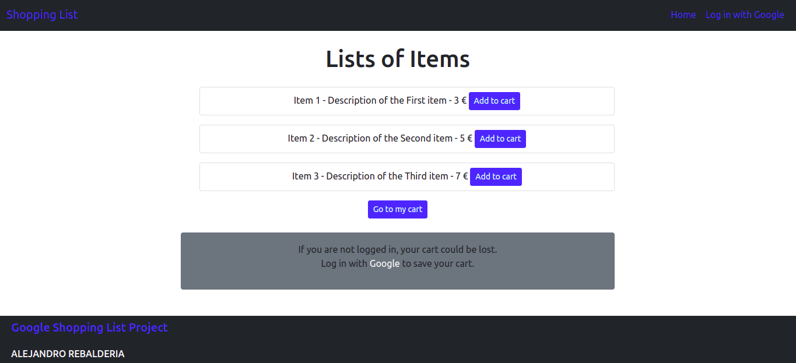
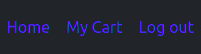
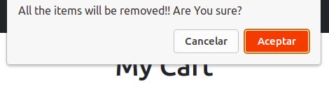

# Shopping List Google Project Interview

This is a small shopping list app for an interview project for Google.

In the app, the user must be able to add an item to the cart, see the whole cart, delete an item or all of them together with a click.

The user must also be able to sign in with their Google account, and the shopping list or cart must persist between their logins.

I created the app in Javascript, using Node Js, Handlebars and Bootstrap.

[The app is deployed and running in Heroku.](http://google-shopping-list.herokuapp.com/)

## Features

The app have two pages, home where the list of items are shown , and my cart where the shopping list is shown.

If the user is not logged in, an alert will be shown to let they know that the cart could be lost if they do not do the log in.

### Home 

### My Cart

### Navbar
If the user is logged in, the navbar shows three links, Home, My Cart and Log out.

If user is not logged in, just two links are show, Home and Log in with Google.

### Footer

There is a simple footer that shows the project name and a link to my portfolio as my name.

## User interaction

The user receives alerts and has to confirm to perform some actions. Alerts after add or delete items, and must confirm for delete an item or all of them.

## Features left to implement

All the requirements required for this project were met.

Although this was a small and simple project, I had in mind to do it as if the project was going to grow in the future. I have created all the folders that I usually use in my similar projects.

This project could grow adding all the features of a CRUD project, adding functionality to manage the project as an admin, deleting items, updating them, etc.

On the user side, adding a contact form so they can send messages, add likes to the products, reviews or criticism of the items and more.

## Bugs

Currently I am having a problem when the user is not logged in. They can add item to the cart and delete them, but if they are in the cart page, then they come back to home and add any new item, this new item or items will replace the current cart. 

There is a problem with the view of the lists as well. I am using Bootstrap and I am setting all the columns as col-md-8, but is like the ul element is no getting the correct center, it is move to the right.

## Validation

No errors were found when passing all the js files through the official [JsHint validator](https://jshint.com/)

I have received some warnings but nothing really important.

## Resourses

### Google Auth

I have learned how to use [Google Auth](https://developers.google.com/identity/protocols/oauth2) from [this tutotial](https://www.youtube.com/watch?v=SBvmnHTQIPY) thanks to [Traversy Media](https://www.youtube.com/c/TraversyMedia)

### Libraries

I heve used [Express](https://expressjs.com/), [Express-session](https://www.npmjs.com/package/express-session), [Express-handlebars](https://www.npmjs.com/package/express-handlebars), [Handlebars](https://handlebarsjs.com/), [Bootstrap](https://getbootstrap.com/), [Mongoose](https://mongoosejs.com/), [Passport](https://www.passportjs.org/), [Passport-google-oauth](http://www.passportjs.org/packages/passport-google-oauth/), [Dotenv](https://www.npmjs.com/package/dotenv) and [Nodemon](https://www.npmjs.com/package/nodemon).

